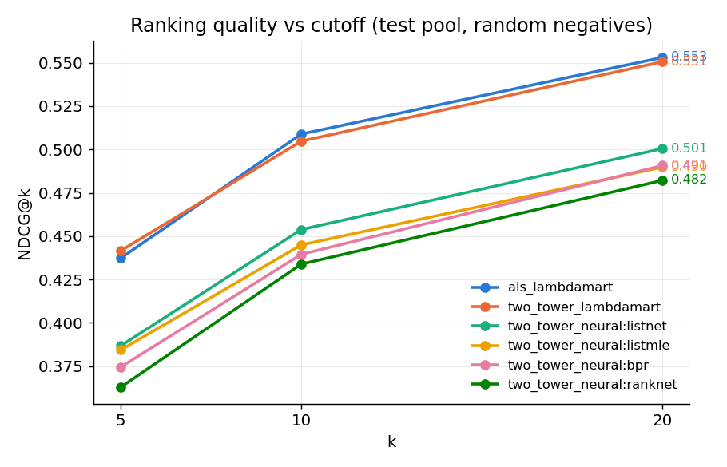
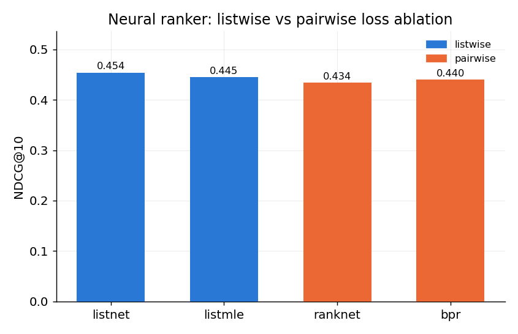

# Video-ranker — a two-stage retrieval → ranking recommender

A reproducible **candidate-generation + ranking** recommender on MovieLens, built
to mirror the funnel used in production video recsys (the TikTok/YouTube pattern):
a cheap retriever narrows millions of items to a few hundred candidates, then an
expensive ranker orders them. It compares a **gradient-boosted ranker
(LambdaMART)** against a **neural ranker** (listwise vs pairwise losses), on top
of two retrievers (**ALS** and a **two-tower** network), and reports standard
learning-to-rank metrics (NDCG, MRR, MAP, Recall) with an honest temporal
evaluation.

---

## Problem framing

For each user, rank a candidate set of items so that items the user actually
engaged with (held-out positives) rank above items they didn't. This is
**learning-to-rank with per-user query groups**. Ratings ≥ 4.0 are treated as
positive engagement (implicit feedback).

The two stages are trained and evaluated separately because they answer different
questions:

- **Stage 1 (retrieval)** — *recall*: can we get the right items into a small
  candidate pool at all? Reported as Recall@100 / Recall@200. This is the
  **ceiling** for stage 2: an item retrieval misses can never be ranked back.
- **Stage 2 (ranking)** — *precision at the top*: given candidates, order them so
  positives land at rank 1–20. Reported as NDCG/MRR/MAP/Recall@{5,10,20}.

## Architecture

```
                         MovieLens ratings.csv / movies.csv
                                       │
                    positives (rating ≥ 4.0), per-user temporal split
                                       │
        ┌──────────────────────────────┴──────────────────────────────┐
        │  train  (history)        valid (ranker labels)     test (final labels)
        └──────────────────────────────┬──────────────────────────────┘
                                       │
              ┌────────────────────────▼────────────────────────┐
   STAGE 1    │  Retriever  (fit on TRAIN only)                  │
   retrieval  │    (a) ALS matrix factorization  [implicit]      │
              │    (b) Two-tower net: user/item towers, dot-     │
              │        product, in-batch sampled-softmax [torch] │
              │  → top-200 candidates/user  + retrieval score    │
              └────────────────────────┬────────────────────────┘
                                       │  Recall@100 / @200  (stage-2 ceiling)
              ┌────────────────────────▼────────────────────────┐
   FEATURES   │  User: count, mean rating, recency, span,        │
              │        genre-affinity vector                     │
              │  Item: popularity, mean rating, count, year,     │
              │        genre multi-hot                           │
              │  Cross: genre-match  +  STAGE-1 RETRIEVAL SCORE   │
              └────────────────────────┬────────────────────────┘
              ┌────────────────────────▼────────────────────────┐
   STAGE 2    │  Ranker A: LightGBM LambdaMART (lambdarank)      │
   ranking    │  Ranker B: MLP + listwise (ListNet/ListMLE) or   │
              │            pairwise (RankNet/BPR) loss            │
              └────────────────────────┬────────────────────────┘
                                       │
                     NDCG / MRR / MAP / Recall @{5,10,20}
                    slices: random vs hard negatives · cold vs active
                                       │
                          FastAPI  GET /rank?user_id=…
```

## Evaluation protocol (the part that has to be right)

- **Temporal leave-last-out, per user.** Each user's interactions are sorted by
  timestamp; the most recent `n_test` are the test positives, the `n_valid`
  before them train the ranker, the rest are history. **No random splitting** —
  that leaks the future into the past. Retrieval and features only ever see data
  that predates the labels they predict, so the split is leakage-free (verified:
  train/test item overlap per user is 0).
- **Negative sampling.** Negatives are items the user never interacted with in
  *any* split (so a "negative" is never secretly a positive elsewhere). Two
  flavours: **uniform** (easy slice) and **popularity-weighted** (hard slice —
  popular items the user skipped are plausible, so they stress the ranker).
- **Grouped metrics.** All metrics are computed per user (query group) and
  averaged, with an honest `n_relevant` denominator equal to the user's true
  number of held-out positives (see [src/metrics.py](src/metrics.py); pinned to
  hand-computed values in [tests/test_metrics.py](tests/test_metrics.py)).
- **The retrieval score is a stage-2 feature.** The stage-1 score is passed into
  the ranker — standard practice, and empirically the single most important
  feature (see analysis).

## Results

ml-latest-small, temporal split (`n_test=2, n_valid=2`), test pool = held-out
positives + 100 sampled negatives, seed 42. Reproduce with `make run-all && make
evaluate`. Full numbers in [results/metrics.csv](results/metrics.csv); slice
breakdown in [results/metrics_full.csv](results/metrics_full.csv).

### Stage 2 — ranking (random-negative pool)

| experiment | recall@200 | ndcg@5 | ndcg@10 | ndcg@20 | mrr@10 | map@10 | recall@10 |
| --- | --- | --- | --- | --- | --- | --- | --- |
| als_lambdamart | 0.4245 | 0.4373 | **0.5089** | 0.5531 | 0.5309 | 0.3933 | 0.6924 |
| two_tower_lambdamart | 0.4552 | 0.4416 | 0.5048 | 0.5506 | 0.5129 | 0.3897 | 0.6957 |
| two_tower_neural:listnet | 0.4552 | 0.3868 | 0.4538 | 0.5006 | 0.4675 | 0.3449 | 0.6310 |
| two_tower_neural:listmle | 0.4552 | 0.3844 | 0.4450 | 0.4898 | 0.4497 | 0.3386 | 0.6235 |
| two_tower_neural:bpr | 0.4552 | 0.3745 | 0.4395 | 0.4908 | 0.4428 | 0.3281 | 0.6294 |
| two_tower_neural:ranknet | 0.4552 | 0.3629 | 0.4339 | 0.4822 | 0.4355 | 0.3214 | 0.6277 |

### Stage 1 — retrieval ceiling

| retriever | Recall@100 | Recall@200 |
| --- | --- | --- |
| ALS | 0.318 | 0.425 |
| Two-tower | 0.332 | 0.455 |




### Scaling to ml-25m

The same pipeline runs unchanged on the full dataset via
`configs/two_tower_lambdamart_25m.yaml` (20k-user subsample of ml-25m: 20,839
items, 1.48M train interactions). More data lifts every metric — retrieval has
more signal to learn and the ranker more examples:

| model | Recall@100 | Recall@200 | NDCG@10 | MRR@10 | MAP@10 | Recall@10 |
| --- | --- | --- | --- | --- | --- | --- |
| two-tower → LambdaMART (ml-25m) | 0.392 | 0.544 | **0.622** | 0.647 | 0.493 | 0.782 |

(Two-tower fit ≈ 100s on CPU; reproduce with `python -m src.train --config
configs/two_tower_lambdamart_25m.yaml`. Kept out of the table above so all
small-dataset rows stay directly comparable.)

### Analysis

**ALS → LambdaMART vs Two-tower → LambdaMART (a near-tie at the top, NDCG@10 =
0.509 vs 0.505).** Gradient-boosted trees on engineered tabular features are a
genuinely hard baseline — LambdaMART directly optimizes a rank-aware objective and
handles the mixed-scale features (counts, ratings, genre one-hots, the retrieval
score) without any normalization. Swapping ALS for the two-tower lifts the stage-1
ceiling (Recall@200 0.425 → 0.455) and matches it on final ranking, so the better
retriever pays off exactly where you'd expect — in recall of good candidates.

**The retrieval score dominates stage 2.** In the two-tower→LambdaMART model the
most important feature by a ~4× margin is the **stage-1 retrieval score** itself
(gain ≈ 7950 vs ≈ 2100 for the next feature, item popularity), followed by user
recency, release year, and the genre-match cross feature. This is precisely why
production systems pass the retriever's score downstream as a ranking feature.

**Two-tower → Neural ranker: listwise beats pairwise (as expected).** The listwise
losses (ListNet 0.454, ListMLE 0.445) beat the pairwise ones (BPR 0.440, RankNet
0.434): optimizing the whole ranked list aligns better with NDCG than optimizing
isolated pairs. The small MLP trails LambdaMART overall — with only ~45 tabular
features and a few hundred users, boosted trees extract more signal than a neural
scorer, a common result at this data scale. ListMLE is the most fragile on the
**hard-negative** slice (NDCG@10 collapses to 0.162 vs ListNet's 0.254) — its
Plackett-Luce likelihood is dominated by a few high-scoring popular negatives.

**Where quality drops.** Every model loses roughly half its NDCG on the
popularity-based **hard-negative** slice (e.g. ALS→LambdaMART 0.509 → 0.279) —
distinguishing genuine engagement from mere popularity is the real difficulty. In
this small dataset cold-start users actually score *higher* than active users
(≈0.57 vs ≈0.48): a cold user has only 1–2 held-out positives in the pool, so
placing them well is easier than correctly ordering an active user's many
positives — an artifact worth flagging rather than hiding.

## Repo structure

```
video-ranker/
  data/
    download.py         # fetch + unzip MovieLens (SSL-robust, --small flag)
  src/
    config.py           # YAML config + global seeding
    data_prep.py        # load, temporal split, negative sampling
    features.py         # user / item / cross feature engineering
    retrieval.py        # ALS + two-tower retrievers
    ranking.py          # LambdaMART + neural ranker (listwise/pairwise)
    metrics.py          # ndcg / mrr / map / recall, grouped by user
    train.py            # config-driven orchestration (one row per run)
    evaluate.py         # aggregates results -> table + plots
    serve.py            # FastAPI /rank endpoint
  configs/              # one YAML per experiment (+ a 25M-scale config)
  notebooks/            # 01_eda.ipynb, 02_results_analysis.ipynb
  results/              # metrics.csv, metrics_full.csv, plots
  scripts/              # fix_macos_openmp.py (LightGBM libomp helper)
  tests/                # test_metrics.py (NDCG vs hand-computed toy example)
  Makefile · requirements.txt
```

## Setup

```bash
python -m venv .venv && source .venv/bin/activate
pip install -r requirements.txt
```

**macOS note:** LightGBM needs an OpenMP runtime. If `import lightgbm` fails with
`Library not loaded: @rpath/libomp.dylib`, run `python scripts/fix_macos_openmp.py`
(links LightGBM's libomp to the one PyTorch ships, avoiding both the missing-lib
and the double-OpenMP-runtime crash) or `brew install libomp`.

## Running

```bash
make data-small          # download ml-latest-small (fast); `make data` for ml-25m
make test                # unit tests (metrics correctness)

make run-als-lgbm        # ALS        -> LambdaMART
make run-tt-lgbm         # Two-tower  -> LambdaMART   (also saves the serving bundle)
make run-tt-neural       # Two-tower  -> Neural ranker (listnet/listmle/ranknet/bpr)
make run-all             # all of the above

make evaluate            # build results/metrics.csv + plots + results_table.md
```

Each row is reproduced by a single config, e.g.
`python -m src.train --config configs/two_tower_lambdamart.yaml`. Everything is
seeded; configs live in [configs/](configs/). Scale to the full 25M with
`configs/two_tower_lambdamart_25m.yaml` (uses `data.small: false` and a
`max_users` cap to stay laptop-tractable — remove it for the complete dataset).

## Serving (stretch)

`make run-tt-lgbm` writes `artifacts/serving_bundle.pkl` (retriever + ranker +
feature store + dataset). Then:

```bash
make serve       # uvicorn on :8000
curl "http://localhost:8000/rank?user_id=1&k=10"
```

The endpoint runs the identical funnel — retrieve top-N, assemble features
(including the retrieval score), rank — and returns titled, scored items. Example
top result for user 1: *Butch Cassidy and the Sundance Kid (1969)*.

## Design choices & honesty notes

- **Leakage-free by construction:** features for the ranker come from `train`
  history; test labels are strictly later in time. Retrieval is fit on `train`
  only and used unchanged at eval, so the retrieval-score feature has a consistent
  distribution across train/eval.
- **Ranker comparison vs funnel:** the headline table ranks a fixed pool (test
  positives + sampled negatives) so rankers are compared apples-to-apples; the
  retrieval Recall@k table reports the separate stage-1 ceiling. Both are shown.
- **Stretch — sequential retriever (GRU4Rec):** not implemented; the two
  retrievers and four ranker losses were prioritized. The retriever interface
  (`fit / recommend / score`) is designed so a sequential model drops in as a
  third `build_retriever` option.
```
